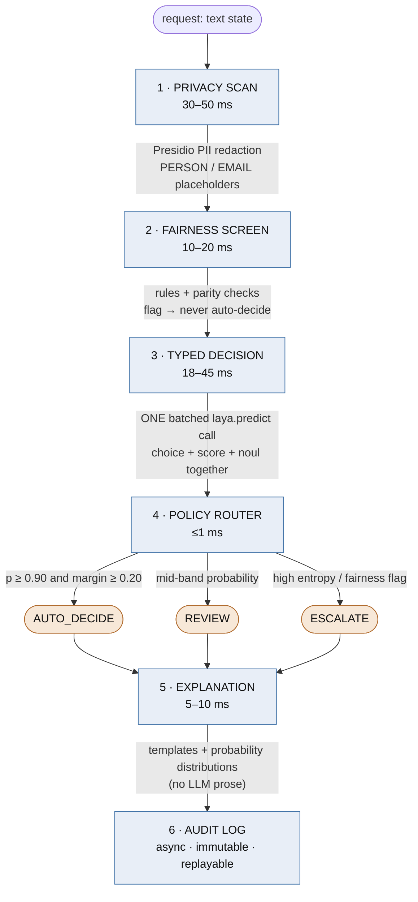
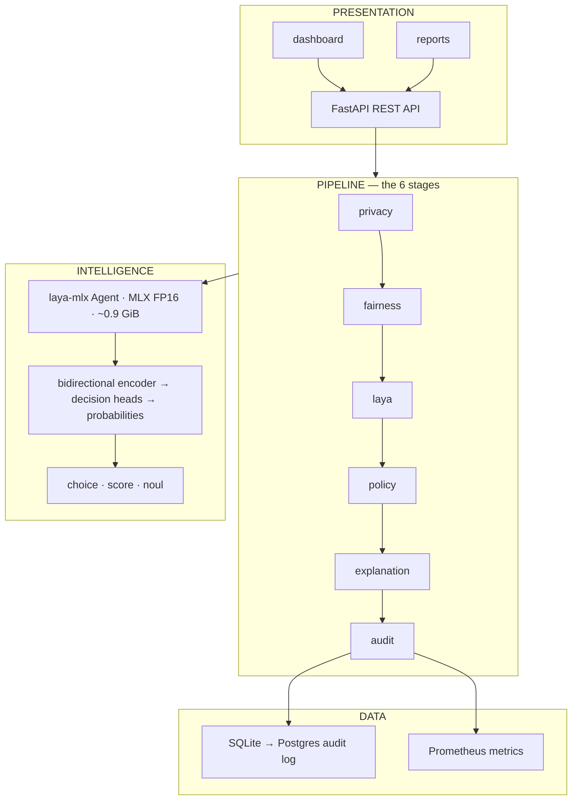
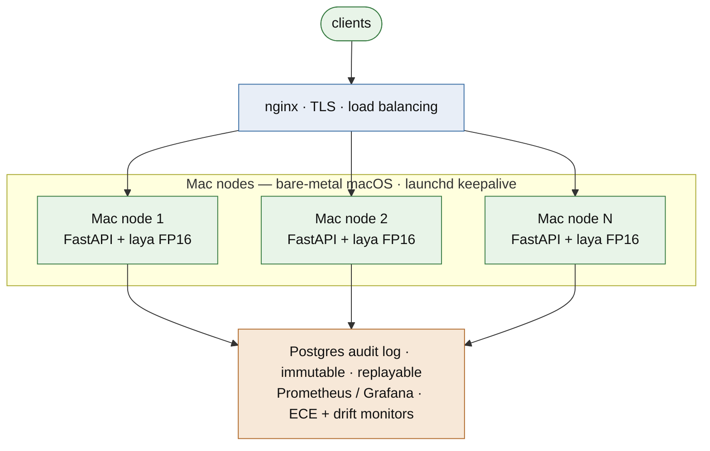

# Autonomous Decision Intelligence Platform (ADIP)

**A decision intelligence platform blueprint built on [Laya](https://huggingface.co/convaiinnovations/laya) typed decision models, served locally via the [laya-mlx](https://github.com/mizorewww/laya-mlx) runtime — free, Apache-2.0, and private by architecture.**

> Status: **planning / blueprint phase**. The full technical blueprint lives in [`explaination-of-the-project.md`](explaination-of-the-project.md) (mirrored in [`professtional-writing-end-sem-project.md`](professtional-writing-end-sem-project.md)). Implementation starts with the Phase 0 MVP (below).

---

## What ADIP does

Turn a **text state** into typed, calibrated, auditable decisions. Support-ticket
triage is the flagship; the same engine handles developer workflows — bug/issue
triage, PR routing, incident severity, log classification (see
[Multi-purpose](#multi-purpose-beyond-ticket-triage) and blueprint §5.1):

```text
choice → probabilities over named options        (route this ticket: billing | technical | sales)
score  → expected rubric level over ordered tiers (urgency: 0–2)
noul   → P(true) for a proposition               (does the customer want money back?)
```

Wrapped in a six-stage pipeline:



End-to-end target: **≤ 150 ms P50** (standard mode), **≤ 400 ms P95**; strict mode adds bounded counterfactual probes (blueprint §10).

## Architecture at a glance



> All of it on one Apple Silicon Mac — nothing leaves the box.

## Why laya-mlx (and not a cloud LLM API)

| | Cloud LLM API (v1 idea) | laya-mlx (v2) |
|---|---|---|
| Cost per decision | API tokens | **$0** marginal, ~$0.000002 hardware amortization |
| Data egress | state leaves the premises | **zero** — all inference is local |
| Output surface | free-text JSON to validate | constrained typed answers — nothing generated to go off-script |
| License / stack | proprietary | Apache-2.0, MLX, no PyTorch runtime, no cloud API |

## Performance (verified against the repo's checked-in `BENCHMARKS.md`)

M3 Max, 40-core GPU, 128 GiB, MLX 0.32.2, FP16, end-to-end (prompt → tokenization → inference → calibration → formatting; load excluded). One machine, one run per configuration.

| Metric | Laya 421M (English) | Multilingual 322M | Typed-decisions 421M |
|---|---|---|---|
| P50 / P95, 1 short question | **17.75 / 21.45 ms** | 10.91 / 19.48 ms | 16.17 / 17.74 ms |
| P50, 1 full-context question | 49.84 ms @ 512 tok | 43.50 ms @ 1,024 tok | 99.95 ms @ 1,024 tok |
| Throughput, 50-question batch-64 | 143.3 q/s | 402.2 q/s | 153.2 q/s |
| Peak MLX allocation, 1 short question | 943.6 MiB | 687.6 MiB | 943.6 MiB |
| Context limit | 512 tokens | 1,024 tokens | 1,024 tokens |

> ⚠️ **Discrepancy note:** the laya-mlx README headline (13.42 / 7.39 ms) does **not** match the repo's own `BENCHMARKS.md` run (17.75 / 10.91 ms). This project quotes `BENCHMARKS.md` and re-measures on its own hardware before citing anything externally. The batch throughput fixture cycles repeated question templates — it is not per-request serving latency.

### Measured on our hardware

Apple M1 Pro (8-core CPU: 6P+2E, **14-core GPU**, Metal 4), 16 GB unified memory, macOS 26.6.2, Python 3.13, FP16 — full method, determinism checks, and raw timing samples in [`benchmarks/README.md`](benchmarks/README.md) and `benchmarks/results/`:

| Call (3 questions, FP16, payload v2) | P50 | P95 |
|---|---:|---:|
| short state, batch_size=1 | 72.2 ms | 73.3 ms |
| short state, batch_size=16 | **61.6 ms** | 62.1 ms |
| ~512-token state, batch_size=1 | 374.2 ms | 375.4 ms |

Takeaway: M1 Pro-class nodes deliver ~62 ms triage decisions with `batch_size=16` (~49/s per node) — inside the ≤ 150 ms pipeline target, but the decision-only < 60 ms gate misses by ~2 ms (recorded, not massaged). Peak RSS ~935–940 MiB matches the published model footprint; all runs 100% deterministic.

## Honest limitations (full list: blueprint §8)

1. **Apple Silicon only** — MLX needs Metal; no Linux/Windows/cloud nodes, no Docker GPU passthrough on macOS. Inference runs bare-metal on macOS under `launchd`.
2. **Triage-style pretrained checkpoints** — not trained on credit/clinical outcomes; other domains need upstream RLCD fine-tuning, gated on eval.
3. **Confidence ≠ accuracy** — calibrated probability is a distribution property, not a promise; the policy router (AUTO / REVIEW / ESCALATE) exists for exactly this.
4. **Temperature clamping** — the runtime clamps calibration temperatures to [0.5, 5.0] and warns; ADIP logs every clamped bucket.
5. **No free-text output** — explanations are assembled from distributions + perturbation attribution, not generated prose.

## Multi-purpose: beyond ticket triage

Ticket triage is one question set, not the product. The engine answers three
kinds of questions (`choice` / `score` / `noul`) about any redacted text — so
the same pipeline (privacy → router → laya → explanation → audit → eval gates)
serves developer workflows too (blueprint §5.1):

| Option | Question set (swap-in) | Types |
|---|---|---|
| Bug/issue triage | severity (P0–P3), component, "duplicate?" | score, choice, noul |
| PR routing | "which team reviews this diff?", "security review?" | choice, noul |
| Incident response | severity scoring, "page the on-call?" | score, noul |
| Log/error classification | error category, P(is-regression), P(is-flaky-test) | choice, noul |
| Internal-tooling support triage | same as the flagship, aimed at dev-portal tickets | choice, score, noul |

Each option: ~50–80 ms per decision, $0 marginal cost, local/private,
deterministic. Each costs ~a day to stand up (question set + small golden set
+ eval gates must pass before it ships).

**Boundary:** it judges and routes; it does not write. No code generation,
summaries, or replies (that needs an audited generative LLM stage), and input
state must fit the ~512-token context — feed a diff *summary*, not a full PR.

## Platform (planned)



~56 decisions/s per node on M3 Max-class (17.75 ms/call, short context); measured 48–60/s on M1 Pro with `batch_size=16`; capacity scales linearly with nodes.

- **Runtime:** Python 3.11+, `uv`, `laya-mlx` with pinned checkpoint revisions + weight checksums
- **Serving:** FastAPI; one uvicorn worker per agent; nginx across Mac nodes for scale-out — **Phase 0 pipeline is built and measured** (`serving/`): end-to-end **P50 80.1 ms / P95 135.3 ms** on the full golden set, inside the ≤ 150 ms target; replayable SQLite WAL audit verified bit-for-bit; Prometheus `/metrics` live
- **Privacy:** Microsoft Presidio redaction before the encoder; k-anonymity on exports
- **Storage:** SQLite (WAL) → PostgreSQL; Prometheus `/metrics` + Grafana
- **CI:** GitHub Actions `macos-14` arm64 (unit tier); nightly fidelity/calibration/latency benchmarks on real hardware

## Roadmap

| Phase | Weeks | Deliverable |
|---|---|---|
| **0 — MVP** | 1–4 | Ticket-triage demo: privacy → laya → policy → explanation → audit, P50 ≤ 150 ms, replayable audit log, honest eval report — **✅ Phase 0 pipeline built & measured: P50 80.1 / P95 135.3 ms** |
| **1 — Hardening** | 5–10 | Counterfactual engine, fairness CI gates, Postgres, multilingual Router with logged routing evidence — **✅ calibration lever landed early: refund ECE 0.0725 → 0.0393 out-of-fold (gate PASS)** |
| **2 — Extension** | 11–16 | Second question set from the Multi-purpose list (bug/issue triage, PR routing, or incident response — eval-gated), RLCD fine-tuning exploration, packaging, load tests |
| **3 — Stretch** | post-sem | Multi-node fleet. Explicitly not promised: SOC 2, FedRAMP, marketplace, 10k req/s clusters |

## Docs

- [`explaination-of-the-project.md`](explaination-of-the-project.md) — full technical blueprint (architecture, schemas, eval strategy, cost model)
- [`professtional-writing-end-sem-project.md`](professtional-writing-end-sem-project.md) — mirror of the blueprint for the end-sem deliverable
- [`benchmarks/`](benchmarks/README.md) — latency harness + stored timing samples (M1 Pro measured)
- [`evals/`](evals/README.md) — eval runner: macro-F1, ECE, Brier, confusion matrix vs the frozen golden set; calibration (`calibrate.py`) + stored per-record predictions
- [`datasets/golden-set/`](datasets/golden-set/README.md) — triage eval dataset: schema, labeling guidelines, exemplars, validator, AI-3 QC worksheet
- [`serving/`](serving/README.md) — Phase 0 pipeline: DecisionService, FastAPI `/decide` + `/audit/{id}/replay` + `/metrics`, load-test tool

## Attribution & licensing

- **Laya** model + pretrained weights: [Convai Innovations](https://huggingface.co/convaiinnovations) (upstream: `NandhaKishorM/laya`)
- **laya-mlx**: independent Apache-2.0 MLX port by [mizorewww](https://github.com/mizorewww/laya-mlx) — not an official Convai release
- MLX: Apple's open-source array framework; ModernBERT / mmBERT encoders under their respective licenses

*Fast, local, constrained — and honest about what it does not know.*
